# Form Builder (fw-form-builder)

fw-form-builder can be used to create/edit/delete fields in an entity. It can also be used to set customized fields, search, re-order fields.

## Demo

```html live
<div
  style="
        width: 100%;
        height: 100%;
        box-sizing: border-box;
        background: #ffffff;
        border: 1px solid rgba(207, 215, 223, 0.4);
        box-shadow: 0px 4px 4px rgba(209, 209, 209, 0.4);
        border-radius: 2px;
        overflow: hidden;
      "
>
  <fw-form-builder id="formBuilder"></fw-form-builder>
</div>

<script type="application/javascript">
  var customizeWidgetFields = [];

  var formValues = {
    name: 'Company-Association-test',
    prefix: '_29',
    title: null,
    description: 'Company-Association-test',
    version: 4,
    deleted: false,
    id: 5938,
    form_options: {},
    created_time: 1659001461188,
    updated_time: 1659004708385,
    icon_link: 'https://d2lz1e868xzctj.cloudfront.net/icons/Accounts.svg',
    fields: [
      {
        id: '24a9531c-3c71-463e-9c63-8991396fde95',
        name: 'companyassociationtestname',
        label: 'Hotel Name',
        type: 'PRIMARY',
        position: 1,
        required: true,
        editable: true,
        visible: true,
        deleted: false,
        placeholder: null,
        hint: null,
        field_options: {
          _analytic: 'true',
          _primary: 'true',
          unique: 'true',
        },
        filterable: true,
        searchable: true,
        parent_id: null,
        choices: [],
      },
      {
        id: 'eea9ed82-af63-43b2-aef0-a7e8de0f8607',
        name: 'companytest',
        label: 'Location',
        type: 'RELATIONSHIP',
        position: 2,
        required: false,
        editable: true,
        visible: true,
        deleted: false,
        placeholder: null,
        hint: null,
        field_options: {
          _analytic: 'true',
          related_object_type: 'NATIVE',
          unique: 'false',
        },
        filterable: true,
        searchable: false,
        parent_id: null,
        related_entity_id: 3,
        relationship_name: 'companytest',
        child_relationship_name: 'companyassociationtest_1659004707038',
        choices: [],
      },
      {
        id: '3f2235be-b18a-443f-9944-c9ae10195e97',
        name: 'contactname',
        label: 'Booking',
        type: 'RELATIONSHIP',
        position: 3,
        required: false,
        editable: true,
        visible: true,
        deleted: false,
        placeholder: null,
        hint: null,
        field_options: {
          _analytic: 'true',
          related_object_type: 'NATIVE',
          unique: 'false',
        },
        filterable: true,
        searchable: false,
        parent_id: null,
        related_entity_id: 2,
        relationship_name: 'contactname',
        child_relationship_name: 'companyassociationtest_1659001527018',
        choices: [],
      },
    ],
  };

  var lookupTargets = [
    {
      value: 1,
      text: 'Ticket',
      isNative: true,
    },
    {
      value: 2,
      text: 'Contact',
      isNative: true,
    },
    {
      value: 4853,
      text: 'Booking ID',
      isNative: false,
    },
    {
      value: 5021,
      text: 'Native-ticket',
      isNative: false,
    },
  ];

  var fb = document.getElementById('formBuilder');
  fb.formValues = formValues;
  fb.lookupTargetObjects = lookupTargets;

  function create_UUID() {
    var dt = new Date().getTime();
    var uuid = 'xxxxxxxx-xxxx-4xxx-yxxx-xxxxxxxxxxxx'.replace(
      /[xy]/g,
      function (c) {
        var r = (dt + Math.random() * 16) % 16 | 0;
        dt = Math.floor(dt / 16);
        return (c == 'x' ? r : (r & 0x3) | 0x8).toString(16);
      }
    );
    return uuid;
  }

  fb.addEventListener('fwComposeNewField', (event) => {
    var objDetail = event.detail;
    var intAddedIndex = -1;
    var arrFields = formValues.fields;
    var intIndex = objDetail.index;
    var objDefaultField = objDetail.fieldSchema;
    objDefaultField.isNew = true;
    objDefaultField.id = 'new-field';

    if (arrFields.length === 0 || intIndex < 0 || intIndex > arrFields.length) {
      arrFields = [...arrFields, objDefaultField];
      intAddedIndex = arrFields.length - 1;
    } else {
      arrFields = [
        ...arrFields.slice(0, intIndex),
        objDefaultField,
        ...arrFields.slice(intIndex),
      ];
      intAddedIndex = intIndex;
    }

    if (intAddedIndex !== -1) {
      formValues = { ...formValues, fields: arrFields };
      fb.formValues = formValues;
      fb.currentFieldIndex = intAddedIndex;
    }
  });

  deleteNewLocalFieldAtIndex = (intIndex) => {
    var arrFields = formValues.fields;
    if (
      arrFields &&
      arrFields.length > 0 &&
      intIndex < arrFields.length &&
      arrFields[intIndex]?.isNew === true
    ) {
      arrFields = [
        ...arrFields.slice(0, intIndex),
        ...arrFields.slice(intIndex + 1),
      ];
      formValues = { ...formValues, fields: arrFields };
      fb.formValues = formValues;
    }
  };

  fb.addEventListener('fwExpandField', (event) => {
    var objDetail = event.detail;
    var intIndex = objDetail.index;
    var boolExpanded = objDetail.expanded;
    fb.currentFieldIndex = boolExpanded ? intIndex : -1;
    if (!boolExpanded && objDetail.isNew && intIndex > -1) {
      deleteNewLocalFieldAtIndex(intIndex);
    }
  });

  fb.addEventListener('fwDeleteField', (event) => {
    fb.loading = true;
    var arrFields = formValues.fields;
    arrFields.splice(event.detail.index, 1);
    formValues = { ...formValues, fields: arrFields };
    fb.formValues = formValues;
    fb.loading = false;
  });

  // delete local field which was added if there are no fields present
  deleteNewFieldFromPayload = (arrFields) => {
    try {
      const intNewFieldIndex = arrFields.findIndex(
        (e) => e.id === 'new-field' && e.isNew === true
      );
      if (intNewFieldIndex > -1) {
        arrFields.splice(intNewFieldIndex, 1);
      }
    } catch (error) {}
  };

  fb.addEventListener('fwSaveField', (event) => {
    fb.loading = true;
    var arrFields = formValues.fields;
    var objDetail = event.detail;
    var objFormValues = objDetail.value;
    var boolNewField = objDetail.isNew;
    var intIndex = Object.prototype.hasOwnProperty.call(objDetail, 'index')
      ? objDetail.index
      : -1;
    var intAddedIndex = intIndex;
    var isPrimaryField = !!(
      Object.prototype.hasOwnProperty.call(objFormValues, 'isPrimaryField') &&
      objFormValues.isPrimaryField === true
    );
    var strFieldLabel = objFormValues.name;
    var strFieldType = !isPrimaryField ? objFormValues.type : 'PRIMARY';
    var boolFilterable = Object.prototype.hasOwnProperty.call(
      objFormValues,
      'filterable'
    )
      ? objFormValues.filterable
      : false;
    var boolUnique = Object.prototype.hasOwnProperty.call(
      objFormValues,
      'unique'
    )
      ? objFormValues.unique
      : false;
    var arrChoices =
      Object.prototype.hasOwnProperty.call(objFormValues, 'choices') &&
      objFormValues.choices &&
      objFormValues.choices.length > 0
        ? [...objFormValues.choices]
        : [];

    var strRemovedSpecialChars = strFieldLabel.replace(/[^a-zA-Z0-9 ]/g, '');
    var strGeneratedFieldName = strRemovedSpecialChars
      .split(' ')
      .join('_')
      .toLowerCase();

    // make the api call to save the new/edited field data in the DB
    // Temp - updating local field
    var objUpdatedField = null;
    deleteNewFieldFromPayload(arrFields);

    if (boolNewField) {
      objUpdatedField = {
        id: '',
        name: '',
        label: '',
        type: '',
        required: false,
        filterable: false,
        editable: true,
        visible: false,
        deleted: false,
        link: null,
        placeholder: null,
        hint: null,
        field_options: { unique: false },
        searchable: true,
        parent_id: null,
        choices: [],
      };
      if (strFieldType === 'DECIMAL') {
        objUpdatedField.searchable = false;
      }
      // Name and ID Needs to be generated at the backend
      objUpdatedField.name = strGeneratedFieldName;
      objUpdatedField.id = create_UUID();
    } else {
      if (arrFields && intAddedIndex >= 0 && intAddedIndex < arrFields.length) {
        objUpdatedField = arrFields[intAddedIndex];
      } else {
        console.error('Field not found in entity object..');
        return null;
      }
    }

    var boolUpdateUniqueValue = true;
    if (strFieldType === 'RELATIONSHIP') {
      // update lookup relationship data if its a new Field
      if (boolNewField) {
        var objRelationshipValues = objFormValues.relationship;
        var objRelatedEntity = {
          isNative: false,
          text: objRelationshipValues.target, // display name of the related entity
          value: 1, // id of the related entity
        };
        objUpdatedField.related_entity_id = objRelatedEntity.id;
        objUpdatedField.relationship_name = strGeneratedFieldName; // needs to be unique within the entity
        objUpdatedField.child_relationship_name = `${strGeneratedFieldName}_${new Date().getTime()}`; // needs to be unique within the entity
        objUpdatedField.field_options.unique =
          objRelationshipValues.relationship === 'one_to_one';
      }
      boolUpdateUniqueValue = false;
    }

    objUpdatedField.type = strFieldType;
    objUpdatedField.label = strFieldLabel;
    objUpdatedField.required = objFormValues.required;
    objUpdatedField.filterable = boolFilterable;
    objUpdatedField.choices = arrChoices;
    if (boolUpdateUniqueValue) {
      objUpdatedField.field_options.unique = boolUnique;
    }

    if (boolNewField) {
      // validate if the array is empty or the passed index is invalid - if true -push the element at the end of the array
      if (
        arrFields.length === 0 ||
        intIndex < 0 ||
        intIndex > arrFields.length
      ) {
        arrFields = [...arrFields, objUpdatedField];
        intAddedIndex = arrFields.length - 1;
      } else {
        // store the element at the passed index
        arrFields = [
          ...arrFields.slice(0, intIndex),
          objUpdatedField,
          ...arrFields.slice(intIndex),
        ];
        intAddedIndex = intIndex;
      }
    }

    fb.currentFieldIndex = -1;
    formValues = { ...formValues, fields: arrFields };
    fb.formValues = formValues;
    fb.loading = false;
  });

  fb.addEventListener('fwRepositionField', (event) => {
    var objDetail = event.detail;
    var intSourceIndex = objDetail.sourceIndex;
    var intTargetIndex = objDetail.targetIndex;
    if (intSourceIndex === intTargetIndex) {
      return;
    }

    try {
      var arrFields = formValues.fields;
      var objField = arrFields.splice(intSourceIndex, 1)[0];
      arrFields.splice(intTargetIndex, 0, objField);
      formValues = { ...formValues, fields: arrFields };
      fb.formValues = formValues;
    } catch (error) {
      console.error('Error in repositioning field ' + error);
    }
  });

  fb.addEventListener('fwSaveWidgetFields', (event) => {
    customizeWidgetFields = event.detail;
    fb.customizeWidgetFields = customizeWidgetFields;
    fb.isSavingCustomizeWidget = false;
  });
</script>
```

## Usage

<code-group>
<code-block title="HTML">
```html
<div
  style="
        width: 100%;
        height: 100%;
        box-sizing: border-box;
        background: #ffffff;
        border: 1px solid rgba(207, 215, 223, 0.4);
        box-shadow: 0px 4px 4px rgba(209, 209, 209, 0.4);
        border-radius: 2px;
        overflow: hidden;
      "
>
  <fw-form-builder id="formBuilder"></fw-form-builder>
</div>

<script type="application/javascript">
  var customizeWidgetFields = [];

  var formValues = {
    name: 'Company-Association-test',
    prefix: '_29',
    title: null,
    description: 'Company-Association-test',
    version: 4,
    deleted: false,
    id: 5938,
    form_options: {},
    created_time: 1659001461188,
    updated_time: 1659004708385,
    icon_link: 'https://d2lz1e868xzctj.cloudfront.net/icons/Accounts.svg',
    fields: [
      {
        id: '24a9531c-3c71-463e-9c63-8991396fde95',
        name: 'companyassociationtestname',
        label: 'Hotel Name',
        type: 'PRIMARY',
        position: 1,
        required: true,
        editable: true,
        visible: true,
        deleted: false,
        placeholder: null,
        hint: null,
        field_options: {
          _analytic: 'true',
          _primary: 'true',
          unique: 'true',
        },
        filterable: true,
        searchable: true,
        parent_id: null,
        choices: [],
      },
      {
        id: 'eea9ed82-af63-43b2-aef0-a7e8de0f8607',
        name: 'companytest',
        label: 'Location',
        type: 'RELATIONSHIP',
        position: 2,
        required: false,
        editable: true,
        visible: true,
        deleted: false,
        placeholder: null,
        hint: null,
        field_options: {
          _analytic: 'true',
          related_object_type: 'NATIVE',
          unique: 'false',
        },
        filterable: true,
        searchable: false,
        parent_id: null,
        related_entity_id: 3,
        relationship_name: 'companytest',
        child_relationship_name: 'companyassociationtest_1659004707038',
        choices: [],
      },
      {
        id: '3f2235be-b18a-443f-9944-c9ae10195e97',
        name: 'contactname',
        label: 'Booking',
        type: 'RELATIONSHIP',
        position: 3,
        required: false,
        editable: true,
        visible: true,
        deleted: false,
        placeholder: null,
        hint: null,
        field_options: {
          _analytic: 'true',
          related_object_type: 'NATIVE',
          unique: 'false',
        },
        filterable: true,
        searchable: false,
        parent_id: null,
        related_entity_id: 2,
        relationship_name: 'contactname',
        child_relationship_name: 'companyassociationtest_1659001527018',
        choices: [],
      },
    ],
  };

  var lookupTargets = [
    {
      value: 1,
      text: 'Ticket',
      isNative: true,
    },
    {
      value: 2,
      text: 'Contact',
      isNative: true,
    },
    {
      value: 4853,
      text: 'Booking ID',
      isNative: false,
    },
    {
      value: 5021,
      text: 'Native-ticket',
      isNative: false,
    },
  ];

  var fb = document.getElementById('formBuilder');
  fb.formValues = formValues;
  fb.lookupTargetObjects = lookupTargets;

  function create_UUID() {
    var dt = new Date().getTime();
    var uuid = 'xxxxxxxx-xxxx-4xxx-yxxx-xxxxxxxxxxxx'.replace(
      /[xy]/g,
      function (c) {
        var r = (dt + Math.random() * 16) % 16 | 0;
        dt = Math.floor(dt / 16);
        return (c == 'x' ? r : (r & 0x3) | 0x8).toString(16);
      }
    );
    return uuid;
  }

  fb.addEventListener('fwComposeNewField', (event) => {
    var objDetail = event.detail;
    var intAddedIndex = -1;
    var arrFields = formValues.fields;
    var intIndex = objDetail.index;
    var objDefaultField = objDetail.fieldSchema;
    objDefaultField.isNew = true;
    objDefaultField.id = 'new-field';

    if (arrFields.length === 0 || intIndex < 0 || intIndex > arrFields.length) {
      arrFields = [...arrFields, objDefaultField];
      intAddedIndex = arrFields.length - 1;
    } else {
      arrFields = [
        ...arrFields.slice(0, intIndex),
        objDefaultField,
        ...arrFields.slice(intIndex),
      ];
      intAddedIndex = intIndex;
    }

    if (intAddedIndex !== -1) {
      formValues = { ...formValues, fields: arrFields };
      fb.formValues = formValues;
      fb.currentFieldIndex = intAddedIndex;
    }
  });

  deleteNewLocalFieldAtIndex = (intIndex) => {
    var arrFields = formValues.fields;
    if (
      arrFields &&
      arrFields.length > 0 &&
      intIndex < arrFields.length &&
      arrFields[intIndex]?.isNew === true
    ) {
      arrFields = [
        ...arrFields.slice(0, intIndex),
        ...arrFields.slice(intIndex + 1),
      ];
      formValues = { ...formValues, fields: arrFields };
      fb.formValues = formValues;
    }
  };

  fb.addEventListener('fwExpandField', (event) => {
    var objDetail = event.detail;
    var intIndex = objDetail.index;
    var boolExpanded = objDetail.expanded;
    fb.currentFieldIndex = boolExpanded ? intIndex : -1;
    if (!boolExpanded && objDetail.isNew && intIndex > -1) {
      deleteNewLocalFieldAtIndex(intIndex);
    }
  });

  fb.addEventListener('fwDeleteField', (event) => {
    fb.loading = true;
    var arrFields = formValues.fields;
    arrFields.splice(event.detail.index, 1);
    formValues = { ...formValues, fields: arrFields };
    fb.formValues = formValues;
    fb.loading = false;
  });

  // delete local field which was added if there are no fields present
  deleteNewFieldFromPayload = (arrFields) => {
    try {
      const intNewFieldIndex = arrFields.findIndex(
        (e) => e.id === 'new-field' && e.isNew === true
      );
      if (intNewFieldIndex > -1) {
        arrFields.splice(intNewFieldIndex, 1);
      }
    } catch (error) {}
  };

  fb.addEventListener('fwSaveField', (event) => {
    fb.loading = true;
    var arrFields = formValues.fields;
    var objDetail = event.detail;
    var objFormValues = objDetail.value;
    var boolNewField = objDetail.isNew;
    var intIndex = Object.prototype.hasOwnProperty.call(objDetail, 'index')
      ? objDetail.index
      : -1;
    var intAddedIndex = intIndex;
    var isPrimaryField = !!(
      Object.prototype.hasOwnProperty.call(objFormValues, 'isPrimaryField') &&
      objFormValues.isPrimaryField === true
    );
    var strFieldLabel = objFormValues.name;
    var strFieldType = !isPrimaryField ? objFormValues.type : 'PRIMARY';
    var boolFilterable = Object.prototype.hasOwnProperty.call(
      objFormValues,
      'filterable'
    )
      ? objFormValues.filterable
      : false;
    var boolUnique = Object.prototype.hasOwnProperty.call(
      objFormValues,
      'unique'
    )
      ? objFormValues.unique
      : false;
    var arrChoices =
      Object.prototype.hasOwnProperty.call(objFormValues, 'choices') &&
      objFormValues.choices &&
      objFormValues.choices.length > 0
        ? [...objFormValues.choices]
        : [];

    var strRemovedSpecialChars = strFieldLabel.replace(/[^a-zA-Z0-9 ]/g, '');
    var strGeneratedFieldName = strRemovedSpecialChars
      .split(' ')
      .join('_')
      .toLowerCase();

    // make the api call to save the new/edited field data in the DB
    // Temp - updating local field
    var objUpdatedField = null;
    deleteNewFieldFromPayload(arrFields);

    if (boolNewField) {
      objUpdatedField = {
        id: '',
        name: '',
        label: '',
        type: '',
        required: false,
        filterable: false,
        editable: true,
        visible: false,
        deleted: false,
        link: null,
        placeholder: null,
        hint: null,
        field_options: { unique: false },
        searchable: true,
        parent_id: null,
        choices: [],
      };
      if (strFieldType === 'DECIMAL') {
        objUpdatedField.searchable = false;
      }
      // Name and ID Needs to be generated at the backend
      objUpdatedField.name = strGeneratedFieldName;
      objUpdatedField.id = create_UUID();
    } else {
      if (arrFields && intAddedIndex >= 0 && intAddedIndex < arrFields.length) {
        objUpdatedField = arrFields[intAddedIndex];
      } else {
        console.error('Field not found in entity object..');
        return null;
      }
    }

    var boolUpdateUniqueValue = true;
    if (strFieldType === 'RELATIONSHIP') {
      // update lookup relationship data if its a new Field
      if (boolNewField) {
        var objRelationshipValues = objFormValues.relationship;
        var objRelatedEntity = {
          isNative: false,
          text: objRelationshipValues.target, // display name of the related entity
          value: 1, // id of the related entity
        };
        objUpdatedField.related_entity_id = objRelatedEntity.id;
        objUpdatedField.relationship_name = strGeneratedFieldName; // needs to be unique within the entity
        objUpdatedField.child_relationship_name = `${strGeneratedFieldName}_${new Date().getTime()}`; // needs to be unique within the entity
        objUpdatedField.field_options.unique =
          objRelationshipValues.relationship === 'one_to_one';
      }
      boolUpdateUniqueValue = false;
    }

    objUpdatedField.type = strFieldType;
    objUpdatedField.label = strFieldLabel;
    objUpdatedField.required = objFormValues.required;
    objUpdatedField.filterable = boolFilterable;
    objUpdatedField.choices = arrChoices;
    if (boolUpdateUniqueValue) {
      objUpdatedField.field_options.unique = boolUnique;
    }

    if (boolNewField) {
      // validate if the array is empty or the passed index is invalid - if true -push the element at the end of the array
      if (
        arrFields.length === 0 ||
        intIndex < 0 ||
        intIndex > arrFields.length
      ) {
        arrFields = [...arrFields, objUpdatedField];
        intAddedIndex = arrFields.length - 1;
      } else {
        // store the element at the passed index
        arrFields = [
          ...arrFields.slice(0, intIndex),
          objUpdatedField,
          ...arrFields.slice(intIndex),
        ];
        intAddedIndex = intIndex;
      }
    }

    fb.currentFieldIndex = -1;
    formValues = { ...formValues, fields: arrFields };
    fb.formValues = formValues;
    fb.loading = false;
  });

  fb.addEventListener('fwRepositionField', (event) => {
    var objDetail = event.detail;
    var intSourceIndex = objDetail.sourceIndex;
    var intTargetIndex = objDetail.targetIndex;
    if (intSourceIndex === intTargetIndex) {
      return;
    }

    try {
      var arrFields = formValues.fields;
      var objField = arrFields.splice(intSourceIndex, 1)[0];
      arrFields.splice(intTargetIndex, 0, objField);
      formValues = { ...formValues, fields: arrFields };
      fb.formValues = formValues;
    } catch (error) {
      console.error('Error in repositioning field ' + error);
    }
  });

  fb.addEventListener('fwSaveWidgetFields', (event) => {
    customizeWidgetFields = event.detail;
    fb.customizeWidgetFields = customizeWidgetFields;
    fb.isSavingCustomizeWidget = false;
  });
</script>

````
</code-block>

<code-block title="React">
```jsx
import React, { useState } from 'react';
import { FwFormBuilder } from '@freshworks/platform-ui/react';

export default function EntityBuilder() {
  const initialDefaultEntity = {
    name: 'Company-Association-test',
    prefix: '_29',
    title: null,
    description: 'Company-Association-test',
    version: 4,
    deleted: false,
    id: 5938,
    form_options: {},
    created_time: 1659001461188,
    updated_time: 1659004708385,
    icon_link: 'https://d2lz1e868xzctj.cloudfront.net/icons/Accounts.svg',
    fields: [
      {
        id: '24a9531c-3c71-463e-9c63-8991396fde95',
        name: 'companyassociationtestname',
        label: 'Hotel Name',
        type: 'PRIMARY',
        position: 1,
        required: true,
        editable: true,
        visible: true,
        deleted: false,
        placeholder: null,
        hint: null,
        field_options: {
          _analytic: 'true',
          _primary: 'true',
          unique: 'true',
        },
        filterable: true,
        searchable: true,
        parent_id: null,
        choices: [],
      },
      {
        id: 'eea9ed82-af63-43b2-aef0-a7e8de0f8607',
        name: 'companytest',
        label: 'Location',
        type: 'RELATIONSHIP',
        position: 2,
        required: false,
        editable: true,
        visible: true,
        deleted: false,
        placeholder: null,
        hint: null,
        field_options: {
          _analytic: 'true',
          related_object_type: 'NATIVE',
          unique: 'false',
        },
        filterable: true,
        searchable: false,
        parent_id: null,
        related_entity_id: 3,
        relationship_name: 'companytest',
        child_relationship_name: 'companyassociationtest_1659004707038',
        choices: [],
      },
      {
        id: '3f2235be-b18a-443f-9944-c9ae10195e97',
        name: 'contactname',
        label: 'Booking',
        type: 'RELATIONSHIP',
        position: 3,
        required: false,
        editable: true,
        visible: true,
        deleted: false,
        placeholder: null,
        hint: null,
        field_options: {
          _analytic: 'true',
          related_object_type: 'NATIVE',
          unique: 'false',
        },
        filterable: true,
        searchable: false,
        parent_id: null,
        related_entity_id: 2,
        relationship_name: 'contactname',
        child_relationship_name: 'companyassociationtest_1659001527018',
        choices: [],
      },
    ],
  };

  const lookupTargets = [
    {
      value: 1,
      text: 'Ticket',
      isNative: true,
    },
    {
      value: 2,
      text: 'Contact',
      isNative: true,
    },
    {
      value: 4853,
      text: 'Booking ID',
      isNative: false,
    },
    {
      value: 5021,
      text: 'Native-ticket',
      isNative: false,
    },
  ];

  const [isLoading, setLoading] = useState(false);
  const [formValues, setFormValues] = useState(initialDefaultEntity);
  const [currentFieldIndex, setcurrentFieldIndex] = useState(-1);
  const [customizeWidgetValues, setCustomizeWidgetValues] = useState([]);
  const [isSavingCustomizeWidget, setSavingCustomizeWidget] = useState(false);

  // delete local field which was added if there are no fields present
  const deleteNewFieldFromPayload = arrFields => {
    try {
      const intNewFieldIndex = arrFields.findIndex(e => e.id === 'new-field' && e.isNew === true);
      if (intNewFieldIndex > -1) {
        arrFields.splice(intNewFieldIndex, 1);
      }
    } catch (error) {}
  };

  const createUUID = () => {
    let dt = new Date().getTime();
    const uuid = 'xxxxxxxx-xxxx-4xxx-yxxx-xxxxxxxxxxxx'.replace(/[xy]/g, function (c) {
      const r = (dt + Math.random() * 16) % 16 | 0;
      dt = Math.floor(dt / 16);
      return (c === 'x' ? r : (r & 0x3) | 0x8).toString(16);
    });
    return uuid;
  };

  const saveFieldHandler = async event => {
    setLoading(true);
    let arrFields = formValues.fields;
    const objDetail = event.detail;
    const objFormValues = objDetail.value;
    const boolNewField = objDetail.isNew;
    const intIndex = Object.prototype.hasOwnProperty.call(objDetail, 'index') ? objDetail.index : -1;
    let intAddedIndex = intIndex;
    const isPrimaryField = !!(Object.prototype.hasOwnProperty.call(objFormValues, 'isPrimaryField') && objFormValues.isPrimaryField === true);
    const strFieldLabel = objFormValues.name;
    const strFieldType = !isPrimaryField ? objFormValues.type : 'PRIMARY';
    const boolFilterable = Object.prototype.hasOwnProperty.call(objFormValues, 'filterable') ? objFormValues.filterable : false;
    const boolUnique = Object.prototype.hasOwnProperty.call(objFormValues, 'unique') ? objFormValues.unique : false;
    const arrChoices =
      Object.prototype.hasOwnProperty.call(objFormValues, 'choices') && objFormValues.choices && objFormValues.choices.length > 0 ? [...objFormValues.choices] : [];

    const strRemovedSpecialChars = strFieldLabel.replace(/[^a-zA-Z0-9 ]/g, '');
    const strGeneratedFieldName = strRemovedSpecialChars.split(' ').join('_').toLowerCase();

    // make the api call to save the new/edited field data in the DB
    // Temp - updating local field
    let objUpdatedField = null;
    deleteNewFieldFromPayload(arrFields);

    if (boolNewField) {
      objUpdatedField = {
        id: '',
        name: '',
        label: '',
        type: '',
        required: false,
        filterable: false,
        editable: true,
        visible: false,
        deleted: false,
        link: null,
        placeholder: null,
        hint: null,
        field_options: { unique: false },
        searchable: true,
        parent_id: null,
        choices: [],
      };
      if (strFieldType === 'DECIMAL') {
        objUpdatedField.searchable = false;
      }
      // Name and ID Needs to be generated at the backend
      objUpdatedField.name = strGeneratedFieldName;
      objUpdatedField.id = createUUID();
    } else {
      if (arrFields && intAddedIndex >= 0 && intAddedIndex < arrFields.length) {
        objUpdatedField = arrFields[intAddedIndex];
      } else {
        console.error('Field not found in entity object..');
        return null;
      }
    }

    let boolUpdateUniqueValue = true;
    if (strFieldType === 'RELATIONSHIP') {
      // update lookup relationship data if its a new Field
      if (boolNewField) {
        const objRelationshipValues = objFormValues.relationship;
        const objRelatedEntity = {
          isNative: false,
          text: objRelationshipValues.target, // display name of the related entity
          value: 1, // id of the related entity
        };
        objUpdatedField.related_entity_id = objRelatedEntity.id;
        objUpdatedField.relationship_name = strGeneratedFieldName; // needs to be unique within the entity
        objUpdatedField.child_relationship_name = `${strGeneratedFieldName}_${new Date().getTime()}`; // needs to be unique within the entity
        objUpdatedField.field_options.unique = objRelationshipValues.relationship === 'one_to_one';
      }
      boolUpdateUniqueValue = false;
    }

    objUpdatedField.type = strFieldType;
    objUpdatedField.label = strFieldLabel;
    objUpdatedField.required = objFormValues.required;
    objUpdatedField.filterable = boolFilterable;
    objUpdatedField.choices = arrChoices;
    if (boolUpdateUniqueValue) {
      objUpdatedField.field_options.unique = boolUnique;
    }

    if (boolNewField) {
      // validate if the array is empty or the passed index is invalid - if true -push the element at the end of the array
      if (arrFields.length === 0 || intIndex < 0 || intIndex > arrFields.length) {
        arrFields = [...arrFields, objUpdatedField];
        intAddedIndex = arrFields.length - 1;
      } else {
        // store the element at the passed index
        arrFields = [...arrFields.slice(0, intIndex), objUpdatedField, ...arrFields.slice(intIndex)];
        intAddedIndex = intIndex;
      }
    }

    setcurrentFieldIndex(-1);
    const objResultFormValues = { ...formValues, fields: arrFields };
    setFormValues(objResultFormValues);
    setLoading(false);
  };

  const deleteFieldHandler = async event => {
    const arrFields = formValues.fields;
    arrFields.splice(event.detail.index, 1);
    const objResultFormValues = { ...formValues, fields: arrFields };
    setFormValues(objResultFormValues);
  };

  const repositionFieldHandler = async event => {
    const objDetail = event.detail;
    const intSourceIndex = objDetail.sourceIndex;
    const intTargetIndex = objDetail.targetIndex;
    if (intSourceIndex === intTargetIndex) {
      return;
    }

    try {
      const arrFields = formValues.fields;
      const objField = arrFields.splice(intSourceIndex, 1)[0];
      arrFields.splice(intTargetIndex, 0, objField);
      const objResultFormValues = { ...formValues, fields: arrFields };
      setFormValues(objResultFormValues);
    } catch (error) {
      console.error('Error in repositioning field ' + error);
    }
  };

  const composeNewFieldTypeHandler = event => {
    const objDetail = event.detail;
    let intAddedIndex = -1;
    let arrFields = formValues.fields;
    const intIndex = objDetail.index;
    const objDefaultField = objDetail.fieldSchema;
    objDefaultField.isNew = true;
    objDefaultField.id = 'new-field';

    if (arrFields.length === 0 || intIndex < 0 || intIndex > arrFields.length) {
      arrFields = [...arrFields, objDefaultField];
      intAddedIndex = arrFields.length - 1;
    } else {
      arrFields = [...arrFields.slice(0, intIndex), objDefaultField, ...arrFields.slice(intIndex)];
      intAddedIndex = intIndex;
    }

    if (intAddedIndex !== -1) {
      const objResultFormValues = { ...formValues, fields: arrFields };
      setFormValues(objResultFormValues);
      setcurrentFieldIndex(intAddedIndex);
    }
  };

  const deleteNewLocalFieldAtIndex = intIndex => {
    let arrFields = formValues.fields;
    if (arrFields && arrFields.length > 0 && intIndex < arrFields.length && arrFields[intIndex]?.isNew === true) {
      arrFields = [...arrFields.slice(0, intIndex), ...arrFields.slice(intIndex + 1)];
      const objResultFormValues = { ...formValues, fields: arrFields };
      setFormValues(objResultFormValues);
    }
  };

  const expandFieldHandler = event => {
    const objDetail = event.detail;
    const intIndex = objDetail.index;
    const boolExpanded = objDetail.expanded;
    setcurrentFieldIndex(boolExpanded ? intIndex : -1);

    if (!boolExpanded && objDetail.isNew && intIndex > -1) {
      deleteNewLocalFieldAtIndex(intIndex);
    }
  };

  const saveWidgetFieldsHandler = async event => {
    setCustomizeWidgetValues(event.detail);
    setSavingCustomizeWidget(false);
  };

  return (
    <div
      style={{
        width: '100%',
        height: '100%',
        boxSizing: 'border-box',
        backgroundColor: '#ffffff',
        border: '1px solid rgba(207, 215, 223, 0.4)',
        boxShadow: '0px 4px 4px rgba(209, 209, 209, 0.4)',
        borderRadius: '2px',
        overflow: 'hidden',
      }}
    >
      <FwFormBuilder
        isLoading={isLoading}
        formValues={formValues}
        lookupTargetObjects={lookupTargets}
        currentFieldIndex={currentFieldIndex}
        customizeWidgetFields={customizeWidgetValues}
        isSavingCustomizeWidget={isSavingCustomizeWidget}
        onFwSaveField={saveFieldHandler}
        onFwDeleteField={deleteFieldHandler}
        onFwExpandField={expandFieldHandler}
        onFwRepositionField={repositionFieldHandler}
        onFwComposeNewField={composeNewFieldTypeHandler}
        onFwSaveWidgetFields={saveWidgetFieldsHandler}
      ></FwFormBuilder>
    </div>
  );
}

````

</code-block>
</code-group>


## Choice source dropdowns

When `useChoiceSourceDropdown` is `true`, DROPDOWN fields use `fw-fb-field-choice-source`
instead of manual choice editing.

`choiceDataSources` shape:

```ts
{
  value: string;
  text: string;
  has_sub_items?: boolean;
  fields: Array<{
    value: string;
    text: string;
    column_name?: string;
    option_value_path?: string;
    option_label_path?: string;
    has_dependents?: boolean;
  }>;
  subItems?: Array<{ value: string; text: string }>;
}
```

When a source has `has_sub_items: true`, the host must refresh that source’s `fields`
from `choiceSourceSubItemChangeHandler` after a sub-item is chosen (see
`fw-fb-field-choice-source` docs).

<!-- Auto Generated Below -->


## Properties

| Property                              | Attribute                                   | Description                                                                                                                                                                                                                                                                                                                                                                            | Type                                                                  | Default                                                  |
| ------------------------------------- | ------------------------------------------- | -------------------------------------------------------------------------------------------------------------------------------------------------------------------------------------------------------------------------------------------------------------------------------------------------------------------------------------------------------------------------------------- | --------------------------------------------------------------------- | -------------------------------------------------------- |
| `choiceDataSources`                   | --                                          | Data sources and field options for choice-source dropdown fields. Shape: `{ value, text, has_sub_items?, fields: [{ value, text, column_name?, option_value_path?, option_label_path?, has_dependents? }], subItems? }`.  When `has_sub_items` is true, `fields` are typically empty until the host refreshes them from `choiceSourceSubItemChangeHandler` after a sub-item is chosen. | `ChoiceDataSourceOption[]`                                            | `null`                                                   |
| `choiceSourceDataSourceChangeHandler` | --                                          | Callback invoked when the choice source data source dropdown changes                                                                                                                                                                                                                                                                                                                   | `(sourceId: string) => void \| Promise<void>`                         | `undefined`                                              |
| `choiceSourceSubItemChangeHandler`    | --                                          | Callback invoked when the choice source sub-item dropdown changes. Host must update `choiceDataSources` so the selected source’s `fields` match the chosen sub-item before the dropdown-field select can be used.                                                                                                                                                                      | `(sourceId: string, subItemId: string) => void \| Promise<void>`      | `undefined`                                              |
| `currentFieldIndex`                   | --                                          | Prop to store the expanded field index                                                                                                                                                                                                                                                                                                                                                 | `{}`                                                                  | `{}`                                                     |
| `customizeWidgetFields`               | `customize-widget-fields`                   | variable to store customize widget fields                                                                                                                                                                                                                                                                                                                                              | `any`                                                                 | `null`                                                   |
| `dependentFieldLink`                  | `dependent-field-link`                      | link to show dependent field document                                                                                                                                                                                                                                                                                                                                                  | `string`                                                              | `''`                                                     |
| `dynamicSectionsBetaEnabled`          | `dynamic-sections-beta-enabled`             |                                                                                                                                                                                                                                                                                                                                                                                        | `boolean`                                                             | `false`                                                  |
| `emptySearchImage`                    | `empty-search-image`                        | svg image to be shown for empty record                                                                                                                                                                                                                                                                                                                                                 | `any`                                                                 | `null`                                                   |
| `formValues`                          | `form-values`                               | variable to store form values                                                                                                                                                                                                                                                                                                                                                          | `any`                                                                 | `null`                                                   |
| `isLoading`                           | `is-loading`                                | flag to notify if an api call is in progress                                                                                                                                                                                                                                                                                                                                           | `boolean`                                                             | `false`                                                  |
| `isSavingCustomizeWidget`             | `is-saving-customize-widget`                | flag to notify if an api call to save the widget is completed                                                                                                                                                                                                                                                                                                                          | `boolean`                                                             | `false`                                                  |
| `lookupTargetObjects`                 | `lookup-target-objects`                     | object to store the lookup target entities                                                                                                                                                                                                                                                                                                                                             | `any`                                                                 | `null`                                                   |
| `permission`                          | --                                          | Permission object to restrict features based on permissions "view" needs to be set to true for the rest of the permissions to be applicable By default, all the permissions are set to true to give access to all the features Example permission object : { view: true, create: true, edit: true, delete: true }                                                                      | `{ view: boolean; create: boolean; edit: boolean; delete: boolean; }` | `{ view: true, create: true, edit: true, delete: true }` |
| `productName`                         | `product-name`                              | The db type used to determine the json to be used for CUSTOM_OBJECTS or CONVERSATION_PROPERTIES                                                                                                                                                                                                                                                                                        | `"CONVERSATION_PROPERTIES" \| "CUSTOM_OBJECTS"`                       | `'CUSTOM_OBJECTS'`                                       |
| `role`                                | `role`                                      | Show explore plans button and disable features for free-plan users                                                                                                                                                                                                                                                                                                                     | `"admin" \| "trial"`                                                  | `'admin'`                                                |
| `showDependentField`                  | `show-dependent-field`                      | flag to show dependentField for CONVERSATION_PROPERTIES or not                                                                                                                                                                                                                                                                                                                         | `boolean`                                                             | `true`                                                   |
| `showDependentFieldResolveProp`       | `show-dependent-field-resolve-prop`         | flag to show dependentField resolve checkbox                                                                                                                                                                                                                                                                                                                                           | `boolean`                                                             | `true`                                                   |
| `showLookupField`                     | `show-lookup-field`                         | flag to show lookupField for CONVERSATION_PROPERTIES or not                                                                                                                                                                                                                                                                                                                            | `boolean`                                                             | `true`                                                   |
| `showRelationshipTypeSelect`          | `show-relationship-type-select`             | flag to show relationshipTypeSelect dropdown or not                                                                                                                                                                                                                                                                                                                                    | `boolean`                                                             | `true`                                                   |
| `supportDependentAndMSDDInSections`   | `support-dependent-and-m-s-d-d-in-sections` | flag to support dependentFields & Multi select dropdown within sections                                                                                                                                                                                                                                                                                                                | `boolean`                                                             | `false`                                                  |
| `theme`                               | `theme`                                     | Theme configuration for the form builder UI                                                                                                                                                                                                                                                                                                                                            | `"default" \| "dew-dark-theme" \| "dew-light-theme"`                  | `'default'`                                              |
| `useChoiceSourceDropdown`             | `use-choice-source-dropdown`                | When true, DROPDOWN fields use fw-fb-field-choice-source instead of manual choices                                                                                                                                                                                                                                                                                                     | `boolean`                                                             | `false`                                                  |
| `userPlan`                            | `user-plan`                                 | Show explore plans and disable features for user having free-plan                                                                                                                                                                                                                                                                                                                      | `"admin" \| "trial"`                                                  | `'admin'`                                                |


## Events

| Event                | Description                                                               | Type               |
| -------------------- | ------------------------------------------------------------------------- | ------------------ |
| `fwComposeNewField`  | Triggered when a new field type is dropped / added inside the fields area | `CustomEvent<any>` |
| `fwDeleteField`      | Triggered on Delete field button click from the field list items          | `CustomEvent<any>` |
| `fwExpandField`      | Triggered when the field is expanded or collapsed                         | `CustomEvent<any>` |
| `fwExplorePlan`      | Triggered when the explore plans button is clicked for free plan users    | `CustomEvent<any>` |
| `fwRepositionField`  | Triggered when the position of a field is changed using drag and drop     | `CustomEvent<any>` |
| `fwSaveField`        | Triggered on Add/Save field button click from the field list items        | `CustomEvent<any>` |
| `fwSaveWidgetFields` | Triggered on saving the widget fields                                     | `CustomEvent<any>` |
| `fwSearchField`      | Triggered on search                                                       | `CustomEvent<any>` |


## Methods

### `forceRenderFields() => Promise<void>`

Method to force render the drag container's children containing all the added fields

#### Returns

Type: `Promise<void>`


## Dependencies

### Depends on

- fw-icon
- fw-button
- [fw-field-type-menu-item](components)
- fw-tooltip
- [fb-section-create](components)
- fw-drag-container
- fw-modal
- fw-inline-message
- [fb-field-drag-drop-item](components)
- [fw-widget-customize-field-item](components)
- fw-select
- fw-input
- fw-modal-title
- fw-modal-content
- fw-modal-footer

### Graph

```mermaid
graph TD;
  fw-form-builder --> fw-icon
  fw-form-builder --> fw-button
  fw-form-builder --> fw-field-type-menu-item
  fw-form-builder --> fw-tooltip
  fw-form-builder --> fb-section-create
  fw-form-builder --> fw-drag-container
  fw-form-builder --> fw-modal
  fw-form-builder --> fw-inline-message
  fw-form-builder --> fb-field-drag-drop-item
  fw-form-builder --> fw-widget-customize-field-item
  fw-form-builder --> fw-select
  fw-form-builder --> fw-input
  fw-form-builder --> fw-modal-title
  fw-form-builder --> fw-modal-content
  fw-form-builder --> fw-modal-footer
  fw-button --> fw-spinner
  fw-button --> fw-icon
  fw-field-type-menu-item --> fw-tooltip
  fw-field-type-menu-item --> fw-icon
  fw-tooltip --> fw-popover
  fb-section-create --> fw-button
  fb-section-create --> fw-input
  fb-section-create --> fw-select
  fw-input --> fw-icon
  fw-select --> fw-tag
  fw-select --> fw-popover
  fw-select --> fw-button
  fw-select --> fw-spinner
  fw-select --> fw-icon
  fw-select --> fw-list-options
  fw-tag --> fw-tooltip
  fw-tag --> fw-avatar
  fw-tag --> fw-icon
  fw-list-options --> fw-select-option
  fw-list-options --> fw-input
  fw-select-option --> fw-icon
  fw-select-option --> fw-checkbox
  fw-select-option --> fw-avatar
  fw-checkbox --> fw-icon
  fw-modal --> fw-icon
  fw-modal --> fw-modal-title
  fw-modal --> fw-modal-content
  fw-modal --> fw-modal-footer
  fw-modal-title --> fw-icon
  fw-modal-footer --> fw-button
  fw-inline-message --> fw-icon
  fb-field-drag-drop-item --> fw-field-editor
  fb-field-drag-drop-item --> fw-button
  fb-field-drag-drop-item --> fw-icon
  fb-field-drag-drop-item --> fb-section-create
  fw-field-editor --> fw-label
  fw-field-editor --> fw-checkbox
  fw-field-editor --> fw-tooltip
  fw-field-editor --> fw-icon
  fw-field-editor --> fw-fb-field-choice-source
  fw-field-editor --> fw-fb-field-dropdown
  fw-field-editor --> fw-toggle
  fw-field-editor --> fw-input
  fw-field-editor --> fw-fb-field-lookup
  fw-field-editor --> fw-button
  fw-field-editor --> fw-spinner
  fw-field-editor --> fw-modal
  fw-field-editor --> fw-inline-message
  fw-fb-field-choice-source --> fw-select
  fw-fb-field-dropdown --> fw-fb-field-dropdown-item
  fw-fb-field-dropdown --> fw-tooltip
  fw-fb-field-dropdown --> fw-drag-container
  fw-fb-field-dropdown --> fw-button
  fw-fb-field-dropdown --> fw-icon
  fw-fb-field-dropdown --> fw-modal
  fw-fb-field-dropdown-item --> fw-icon
  fw-fb-field-dropdown-item --> fw-input
  fw-toggle --> fw-icon
  fw-fb-field-lookup --> fw-input
  fw-fb-field-lookup --> fw-select
  fw-widget-customize-field-item --> fw-checkbox
  style fw-form-builder fill:#f9f,stroke:#333,stroke-width:4px
```


----------------------------------------------

Built with ❤ at Freshworks
